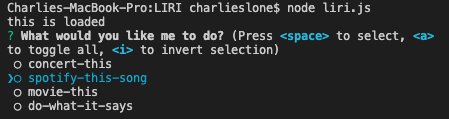
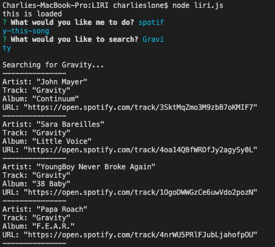

# LIRI

Like 'SIRI' but without the 'S', this CLI application works by taking in a user's written command and value from the command line and returning information to the user based on the given command and value.

## Getting Started

[Demo](https://youtu.be/0ei7fgJWGIU)

Want to try it out?

Just clone the repo in your local machine and open it using node, in you favorite source code editor or bash shell.

Please note, you will have to provide your own API key for Spotify to use the spotify song search feature.

Also, please make sure you do a 'npm install' in your cloned directory to install all of the npm packages used for this aplication. You can see the dependencies in the package.json file.

Once everything is installed, run the command 'node liri.js' in your command line. You will be prompted to select a command and a input for the command you select. Follow the on screen instructions in your command line as to how to select a command.

## Current Commands

The current commands are:
* concert-this: This requires an artist/band as the input and will return the following, in order of most recent first:
  * Name of the venue
  * Venue location
  * Date of the Event 
* spotify-this: This command requires a song name and will return the following, in order of popularity:
  * Artist(s)
  * The song's name
  * A preview link of the song from Spotify
  * The album that the song is from
* movie-this: This command requires a movie name and will return the following:
  * Title of the movie.
  * Year the movie came out.
  * IMDB Rating of the movie.
  * Rotten Tomatoes Rating of the movie.
  * Country where the movie was produced.
  * Language of the movie.
  * Plot of the movie.
  * Actors in the movie.

Example response:

## Challenges

A few challenges that I faced when creating this game were:
* First I started out using process.argv[] for command line arguments but soon realized inquirer would be a better and more user-friendly choice for this application.
* Decoding the APIs, especially navigating through nested arrays and objects in the bandsintown and Spotify APIs. Using for loops proved to be vital for getting a variety of data to display back for the user for each command
* Making the do-what-is-says command use text from a text file was particularly the hardest challenge I tackled. Even splitting the text in the file into two different arrays and then converting them to strings upon use did not provide a good solution. In order to be able to actually pass the text data through the switch, I had to make every command a separate function and then call them (with the correct argument) in the corresponding switch case. Then, in the do-what-it-says case, I had to use another switch to provide the app with directions on which upper level switch case to pass the text command and values into.

## Built With

* [JavaScript](https://developer.mozilla.org/en-US/docs/Web/JavaScript)
* [Node JS](https://nodejs.org/en/)
* [Bandsintown API](https://jquery.com/)
* [Spotify API (NPM)](https://www.npmjs.com/package/node-spotify-api)
* [OMDB API](http://www.omdbapi.com/)
* [NPM Inquirer](https://www.npmjs.com/package/inquirer)
* [NPM Moment JS](https://www.npmjs.com/package/moment)

## Authors

* Charlie Slone - [GitHub](https://github.com/ctslone) - [LinkedIn](https://www.linkedin.com/in/charlie-slone-704311a9/)
